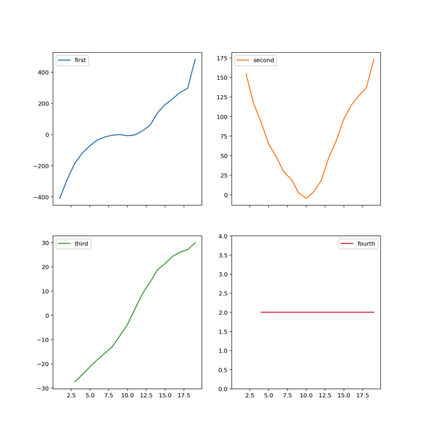
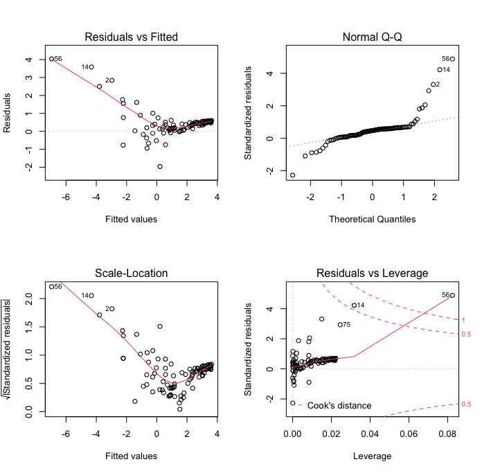

**IMPORTANT:** In problem 2 please set a random seed so that your results are reproducible.

**SUPER IMPORTANT:** Your exam is due by 11:00 a.m. tomorrow as an Rmd file.

# Problem 1 (25 pts.)

Ol' Doc Ridenhour is droning on again about the wonders of math in an 8:30 a.m. Calc 3 class. You, and most of your classmates, barely got any sleep last night; you look over your shoulder and see your friend has already succumbed to the sandman, and others nearby are close as well. From a biology class you took, you remember the average length of a nap is 15 minutes; once awake again, people are unlikely to fall asleep for many hours. You also recall that sleep (like yawns) spreads through a crowd as a diffusion process and depends **proportionally** on the square root-concentration of people that are asleep.

 1. Write down a system of **difference** equations that describes the dynamics of students sleeping in Calc 3.
 
    One *possible* answer would be something like:
    $$
    \begin{aligned}
    \Delta A & = -\rho A \sqrt{\frac{Z}{70}} \\
    \Delta Z & =   \rho A \sqrt{\frac{Z}{70}} - \frac{Z}{15}
    \end{aligned}
    $$
    where $\rho$ is the constant of proportionality, $A$ is the number of awake students who have not previously fallen asleep, and $Z$ is the number of students that are asleep.
 
 2. Based on your equations, under what condition does the number of sleeping students increase during the period?
 
    This depends on the system written down in (1). For the above example, we solve $\Delta Z >0$ for $\rho$ which yields $\rho  = \frac{ \sqrt{70 Z}}{15 A}$, which at $t = 0$ gives $\rho > \frac{ \sqrt{70}}{1035} \approx 0.0081$.
 
 3. Using one minute time steps, and assuming that one student is asleep at the very begginning of class (Billy), iterate the system of equations for a 50 minute class of 70 students. Assume the proportionality constant to be 0.02.
  - Plot the resulting data for both awake and asleep students.
  - Vary the constant of proportionality some (pick 2 more values); iterate and plot the results.
  
```{python, fig.width = 6.5}
import pandas as pd
import numpy as np
import plotnine as p9
import matplotlib.pyplot as plt

rho = 0.02
A = 69
Z = 1

data = pd.DataFrame(columns = ['Time','A','Z','rho'])

#I will choose 0.03 and 0.01 as my other values of rho
rhoVals = np.array([0.02, 0.03, 0.01])

for j in rhoVals:
  rho = j
  A = 69.
  Z = 1.
  data = data.append(pd.DataFrame({'Time':[0.], 'A' : [A], 'Z' : [Z], 'rho' : [rho]}), ignore_index=True)
  for i in np.arange(100):
    DeltaA = -rho*A*(Z/70)**0.5
    DeltaZ = rho*A*(Z/70)**0.5 - Z/15
    A = A + DeltaA
    Z = Z + DeltaZ
    data = data.append(pd.DataFrame({'Time': [i + 1], 'A' : [A], 'Z' : [Z], 'rho': [rho]}), ignore_index=True)

(p9.ggplot(data) + p9.aes(x='Time', y = 'Z', group = 'factor(rho)', color = 'factor(rho)') 
    + p9.geom_line()  + p9.theme_bw() + p9.theme() + p9.ylab('Number of Students Asleep')
    + p9.scale_color_discrete(name='rho'))

plt.close()
    
(p9.ggplot(data) + p9.aes(x = 'Time', y = '70 - Z', group = 'rho', color = 'factor(rho)') 
    + p9.geom_line()  + p9.theme_bw() + p9.ylab('Number of Students Awake')
    + p9.scale_color_discrete(name='rho'))

plt.close()

```  
  
  
 4. According to your model (with the originally assumed proportionality constant), what is the probability that you fell asleep during the lecture?
    
    We can easily find the proportion of students who had fallen asleep during the class by calculating $(70 - A_{50})/70$, which for the original $\rho = 0.02$ and the model above yields $P_{sleeper} =$  `r round(1 - reticulate::py$data$A[51]/70,4)`.
 
 5. How many students would you expect to still be asleep at the end of the lecture?
 
    This is simply checking what $Z_{50}$ is for the given model; here it is $Z_{50} =$ `r round(reticulate::py$data$Z[51],4)`.
 
 6. When does the maximum number of students that are asleep occur? (*Hint:* Make sure you check times longer than 50 minutes if your number of sleeping students is still increasing at 50 minutes.)
 
    Now we look in our data frame for the time at which $\max(Z)$ occurs. For the example model, $t_{\max} =$ `r reticulate::py$data$Time[which.max(reticulate::py$data$Z * (reticulate::py$data$rho == 0.02))]` which you can visually confirm by looking at the plot.
    
    
 7. You decide that it is necessary to fit a model to actual data. While diligently staying awake, you observe when each new individual falls asleep and the total number asleep at that time. For your model, fit the proportionality constant by using optimization based on the *median absolute deviation*, the Brent algorithm, and the following data:

```{r, echo = F}
sleepers <- data.frame(Minutes = c(5, 7, 10, 12, 14, 16, 18, 20, 21, 23, 25, 27, 28, 30, 32, 33, 35, 37, 39, 41, 42, 44, 46, 48), Asleep = c(2, 2, 3, 4, 4, 5, 5, 6, 6, 6, 6, 7, 7, 7, 7, 7, 8, 8, 8, 8, 8, 8, 8, 8))
knitr::kable(sleepers)
```

To accomplish, recall that we need to write down a function that applies whatever criteria we wish to modeled data ($\hat{y}$) and the actual data ($y$). We also need an objective function that will take parameters and calculate $\hat{y}$ and return the value of the criteria. Once we have those two functions we can then run `minimize()`.
    
    
```{python}
import scipy.optimize as optim

def medianAD(y, yhat): return np.median(np.abs(y - yhat))

def objectiveFunction(x, obs, dist = medianAD):
  
  rho = x
  A = 69.
  Z = 1.
  
  sim = pd.DataFrame({'Time':[0.], 'A':[A], 'Z':[Z]})
  
  for i in np.arange(100):
    DeltaA = -rho*A*(Z/70)**0.5
    DeltaZ = rho*A*(Z/70)**0.5 - Z/15
    A = A + DeltaA
    Z = Z + DeltaZ
    sim = sim.append(pd.DataFrame({'Time': [i + 1], 'A' : [A], 'Z' : [Z]}), ignore_index=True)
    
  return dist(obs.Asleep.values, sim.Z.values[sim.Time.isin(obs.Minutes)])  

fit1 = optim.brent(objectiveFunction, args = (r.sleepers, medianAD), brack = (0, 0.02,0.1))
fit1 #best value of rho

```


 8. Repeat the optimization two more times but using first the Chebyshev criteria and second a log-likelihood criteria based on a Poisson distribution.
 
    To accomplish this we simply define the two new criteria and pass them to the objective function/`optim()`. Remember however that for likelihood functions, we *maximize* the criterion value.
  
```{python}
import scipy.stats as stats

def chebyshev(y, yhat): return np.max(np.abs(y - yhat))
def llpois(y, yhat): return -1*np.sum(stats.poisson.logpmf(y, yhat))

fit2 = optim.brent(objectiveFunction, args = (r.sleepers, chebyshev), brack = (0, 0.02,0.1))
fit3 = optim.brent(objectiveFunction, args = (r.sleepers, llpois), brack = (0, 0.02,0.1))

[fit2, fit3]
```
 
 
 9. Plot the fitted models in 7 & 8 versus the observed data.
 
```{python, fig.width=6.5}
FitData = pd.DataFrame(columns = ['Time','A','Z','rho'])

rhoVals = np.array([fit1, fit2, fit3])

for j in rhoVals:
  rho = j
  A = 69.
  Z = 1.
  FitData = FitData.append(pd.DataFrame({'Time':[0.], 'A' : [A], 'Z' : [Z], 'rho' : [rho]}), ignore_index=True)
  for i in np.arange(50):
    DeltaA = -rho*A*(Z/70)**0.5
    DeltaZ = rho*A*(Z/70)**0.5 - Z/15
    A = A + DeltaA
    Z = Z + DeltaZ
    FitData = FitData.append(pd.DataFrame({'Time': [i + 1], 'A' : [A], 'Z' : [Z], 'rho': [rho]}), ignore_index=True)

(
  p9.ggplot() + p9.geom_line(FitData, p9.aes('Time','Z',color='factor(rho)',group='factor(rho)'))
    + p9.theme_bw() + p9.ylab('Number of Students Asleep')
    + p9.scale_color_discrete(name = 'Method', labels = ['Chebyshev','Poisson','Median AD'])
    + p9.geom_point(mapping = p9.aes(x='Minutes',y='Asleep'), data=r.sleepers)
) 

plt.close()
```

# Problem 2 (25 pts.)

{width=400px}

Hrothgar, a level 6 half-dwarf warrior, has wandered into the lair of the evil drow elf Grimweard, a level 8 mage. A battle to the death ensues! Fortunately, **our hero got an A in MATH 438** and can figure out what his chances of surviving the harrowing encounter are. Hrothgar is attacking Grimweard with a rather sad club that does 1d6 damage, and, given that he is rather inexperienced, he must roll >11 on 1d20 to actually hit Grimweard; should he roll >17, he gets lucky and gets double the damage. He also has 25 hit points. In comparison, his foe is casting a magic missile spell that does 2d4 damage and requires >6 on 1d10 to hit our hero. Grimweard is weaker and only has 15 hit points. Assume that who attacks first is chosen at random. Based on 1000 simulated battles between Hrothgar and Grimweard, answer the following:

  1. Using an empirical cumulative distribution function (eCDF), create a random number generator that takes a single argument ($n$), that returns $n$ random amounts of damage done by Hrothgar. Do this for Grimweard as well. Make 2 histograms using these RNGs by setting $n = 1000$.
  
     To do this, I will create functions that just randomly generate attacks and their damage. Using those, we can simulate a PDF for both Hrothgar and Grimweard. The simulated PDFs are then converted to empirical CDFs that we can directly sample from.
    
```{python}
import statsmodels.distributions.empirical_distribution as ed
import scipy.interpolate as interp

rng = np.random
rng.seed(132412)

def hrothgar_attack():
  hit_die = rng.choice(20) + 1 #need to add 1 because numbers range from 0:19 otherwise
  dmg = rng.choice(6) + 1
  if hit_die > 17: return dmg*2
  if hit_die > 11: return dmg
  return 0

def grimweard_attack():
  hit_die = rng.choice(10) + 1
  dmg = np.sum(rng.choice(4,2)) + 2
  if hit_die > 6: return dmg
  return 0

CDF_hrothgar = ed.ECDF([hrothgar_attack() for _ in range(1000)])
rdmg_hrothgar =  interp.interp1d(CDF_hrothgar(np.arange(13)), np.arange(13), kind='next', fill_value='extrapolate')

CDF_grimweard = ed.ECDF([grimweard_attack() for _ in range(1000)])
rdmg_grimweard = interp.interp1d(CDF_grimweard(np.arange(9)), np.arange(9), kind='next', fill_value='extrapolate')


plt.hist(rdmg_hrothgar(rng.uniform(size=1000)), bins = np.arange(14), align='left')
plt.xlabel('Damage')
plt.title('Hrothgar\'s Damage PDF')
plt.show()
plt.close()

plt.hist(rdmg_grimweard(rng.uniform(size=1000)), bins = np.arange(10), align='left')
plt.xlabel('Damage')
plt.title('Grimweard\'s Damage PDF')
plt.show()
plt.close()

```
  2. What percentage of the time does Hrothgar defeat Grimweard?
     
     Now we actually need to simulate battles between our two contestants. To do this, you have to write a small simulation program and determine who kills whom first following the rules outlined in the problem. Here is how I accomplished this:
    
```{python}
def battle():
  hrothgar = 25
  grimweard = 15
  
  #generate random damage and then look at the cumulative sum
  cumdmg_hrothgar = np.cumsum(rdmg_hrothgar(rng.uniform(size=100))) 
  cumdmg_grimweard = np.cumsum(rdmg_grimweard(rng.uniform(size=100))) 
  
  #figure out how many turns it took for the cumulative sum to exceed the respective HP values
  nToWin_hrothgar = np.sum(cumdmg_hrothgar < grimweard) + 1
  nToWin_grimweard = np.sum(cumdmg_grimweard < hrothgar) + 1
  
  #check the number of turns and determine who won; if turn count is equal, pick someone randomly 
  if nToWin_grimweard == nToWin_hrothgar: return pd.DataFrame({'Winner': [rng.choice(["Hrothgar","Grimweard"])], 'Attacks': [nToWin_grimweard]})
  if nToWin_grimweard < nToWin_hrothgar: return pd.DataFrame({'Winner': ["Grimweard"], 'Attacks':[nToWin_grimweard]})
  return  pd.DataFrame({'Winner': ["Hrothgar"], 'Attacks':[nToWin_hrothgar]})

#FIGHT!!!!
results = battle()
for i in range(999): results = results.append(battle(), ignore_index = True)

results.Winner.value_counts()/1000
```
     
  Our hero Hrothgar is dominating in this fight! He is winning an astounding  `r table(reticulate::py$results$Winner)[2]/1000*100`% of the simulations.
     
  3. How many turns, on average (mean and median), does it take Hrothgar to defeat Grimweard? What is the 95% CI?
  
     To answer this, we simply get the appropriate summary statistics from the results.
    
```{python}
results.Attacks[results.Winner == "Hrothgar"].mean()
np.quantile(results.Attacks[results.Winner == "Hrothgar"], [0.025,0.5,0.975])
```
  
  It looks like it takes Hrothgar $\sim 7$ attacks to dispatch Grimweard and we're very confident that he will get the job done in somewhere between 2 and 15 attacks!
  
  4. How many turns, on average (mean and median), does it take Grimweard to defeat Hrothgar? What is the 95% CI?
  
     Now we repeat this for Grimweard:
  
```{python}
results.Attacks[results.Winner == "Grimweard"].mean()
np.quantile(results.Attacks[results.Winner == "Grimweard"], [0.025,0.5,0.975])
```
  
  Looking at Grimweard's statistics, it is clear why he is losing to Hrothgar: it takes him an average of around 10 attacks to kill Hrothgar, and his lower 95% bound is 6 attacks! 
  
  5. Assume that the battle does not need to be to the death, but that Hrothgar can decide to flee the battle below some threshold. Once Hrothgar decides to flee, Grimweard is allowed to attack him one last time. Search for an optimal threshold where fleeing improves Hrothgar's chance of survival, but does not affect his chance of winning much. Create a table that has 3 pieces of information: the threshold at which Hrothgar flees, the percentage of the battles he wins, and the percentage of times that fleeing prevented dying (i.e., Hrothgar fled and Grimweard did not manage to kill him with his last attack).
  
    To answer this question, we need to add a condition where Hrothgar flees to the `battle()` function. We also want to track whether Hrothgar flees, and, if he does, whether he still dies or not due to Grimweard's final attack.
    
```{python}
#thresh is the threshold at which Hrothgar runs
def battle2(thresh=0):
  hrothgar = 25
  grimweard = 15
  
  #generate random damage and then look at the cumulative sum
  cumdmg_hrothgar = np.cumsum(rdmg_hrothgar(rng.uniform(size=100))) 
  cumdmg_grimweard = np.cumsum(rdmg_grimweard(rng.uniform(size=100))) 
  
  #figure out how many turns it took for the cumulative sum to exceed the respective HP values
  nToWin_hrothgar = np.sum(cumdmg_hrothgar < grimweard) + 1
  nToWin_grimweard = np.sum(cumdmg_grimweard < hrothgar - thresh) + 1
  
  #similar logic as previous function, but we track fleeing and death now
  if nToWin_hrothgar < nToWin_grimweard: return pd.DataFrame({'Winner': ["Hrothgar"], 'Flee':[False], 'Killed':[False]})
  if (nToWin_grimweard == nToWin_hrothgar) & (rng.choice(['Hrothgar','Grimweard']) == 'Hrothgar'):
    pd.DataFrame({'Winner': ["Hrothgar"], 'Flee':[False], 'Killed':[False]})
  return pd.DataFrame({'Winner': ["Grimweard"], 
                       'Flee':[cumdmg_grimweard[nToWin_grimweard - 1] >= hrothgar - thresh], 
                       'Killed':[cumdmg_grimweard[nToWin_grimweard] >= hrothgar]})

strategy = pd.DataFrame(columns=['threshold','winning_percent','saved_death'])              
for i in range(25):
  results2 = battle2(i)
  for j in range(999): results2 = results2.append(battle2(i),ignore_index=True)
  winning_percentage = np.sum(results2.Winner == 'Hrothgar')/1000
  saved_death = np.sum((results2.Winner == 'Grimweard') & np.logical_not(results2.Killed) & results2.Flee)/np.sum((results2.Winner == 'Grimweard') & results2.Flee)
  strategy = strategy.append(pd.DataFrame({'threshold':[i], 'winning_percent':[winning_percentage], 'saved_death':[saved_death]}), ignore_index=True)
```

```{r}
knitr::kable(reticulate::py$strategy)
```

  6. What would you recommend Hrothgar do?

     This is totally up to our hero's danger tolerance and the risk-reward of the battle! Assuming a reasonably strong payoff for vanquishing Grimweard, I would suggest fleeing at around 4 HP. At this threshold, Hrothgar still wins $>70$% of battles, but he dies at half (!!!) the rate of staying in the battle longer.

# Problem 3 (5 pts.)

Examine the following plots of divided differences. Based on the plots, do you think there is an obvious polynomial order with which to fit the underlying data? Explain your answer!!

{width=600px}

It looks like a 4th degree polynomial would work best for fitting these data. The fourth divided differences are essentially constant, which is what we would expect for a 4th degree polynomial. We also see patterns that look cubic, quadratic, and linear for the first, second, and third divided differences, respectively; all of this supports the conclusion that we should use a 4th order polynomial to fit the data.

# Problem 4 (5 pts.)

Given the points (0,2), (1,5), (2,1), write out the **unsimplified** Lagrange polynomial (i.e., do not try to simplify the sum or the fractions). After you have written down the polynomial, use the computer to evaluate the polynomial at $x = 0.5$.

$$
\begin{aligned}
L(x) & = y_0 \frac{(x - x_1)(x - x_2)}{(x_0 - x_1)(x_0 - x_2)} + y_1 \frac{(x - x_0)(x - x_2)}{(x_1 - x_0)(x_1 - x_2)} + y_2 \frac{(x - x_0)(x - x_1)}{(x_2 - x_0)(x_2 - x_1)}  \\
L(x) & = 2 \frac{(x - 1)(x - 2)}{(-1)(- 2)} + 5 \frac{(x)(x - 2)}{(1)(1 - 2)} + 1 \frac{(x)(x - 1)}{(2)(2 - 1)} \\
L(x) & = (x - 1)(x - 2) - 5 (x)(x - 2) + \frac{(x)(x - 1)}{2} \\
L(x) & = x^2 - 3x + 2 - 5x^2 + 10x + \frac{1}{2}x^2 - \frac{1}{2}x \\
L(x) & = - \frac{7}{2}x^2 + \frac{13}{2} x + 2 \\
L\left(\frac{1}{2}\right) & = - \frac{7}{8} + \frac{13}{4} + 2 = \frac{35}{8} = 4.375
\end{aligned}
$$

# Problem 5 (5 pts.)

Derive the inverse CDF that could be used to generate random numbers distributed according to $p(x) = 2 x - 3$ on the interval $x \in [2,4]$.

First, we need to normalize the area under the curve to be one. To do this, we find the integral of $p(x)$ over the interval $[2,4]$:
$$\int^4_2 2x-3\,dx = x^2 - 3x\bigg|^4_{x=2} = 16 - 12 - (4 - 6) = 6$$
Therefore the normalized curve is simply $p'(x) = \frac{1}{6} p(x) = \frac{1}{6}(2 x - 3)$. Next, we need to find the CDF. The CDF is given by:

$$ \Phi(x) = \frac{1}{6}\int^x_2 2z -3 \,dz = \frac{1}{6}\left(z^2 - 3 z\bigg|^x_{z=2}\right) = \frac{1}{6}(x^2 - 3x - (4 - 6)) = \frac{1}{6}(x^2 - 3x + 2)$$.


Finally, we wish to solve for the previous equation for $x$ given $\Phi(x) \in [0,1]$.

$$
\begin{aligned}
q & = \frac{1}{6}(x^2 - 3x +2) \\
  \frac{1}{6}(x^2 - 3x +2) - q & = 0 \\
   x^2 - 3x +2 - 6q & = 0 \\
   \therefore  x = \frac{3 \pm \sqrt{9 - 4(2-6q)}}{2} & = \frac{3 \pm \sqrt{1 + 24q}}{2}
\end{aligned}
 $$

However, because we know that $x = 2 \implies q = 0$ and $x = 4 \implies q = 1$, we can eliminate the lower half of the solution and the inverse CDF function is simply $x = \frac{3 + \sqrt{1 + 24q}}{2}$.

# Problem 6 (5 pts.)

Examine the following diagnostic plots produced after a fitting a linear model to some data. Discuss any issues you observe for EACH of the 4 panels. Would you be happy with model based on these diagnostics? How might you fix/improve the model?

{width=600px}

The plots suggest there are some definite issues with the model fit. In the "residuals vs fitted" plot (top left), we can see that our errors are not iid, and that, in particular, when the fitted value is small, the residual is large. The "scale-location" plot (bottom left) is essentially telling us the same thing: small fitted values have abnormally large residuals. The "normal Q-Q" plot shows that we have some "heavy tails" in the distribution of our residuals. Again, this plot shows that we have a preponderance of large, positive residuals. Finally, the "residuals vs. leverage" plot in the bottom right shows that there are (at least) 2 outliers we might consider trimming from the data: points 56 and 14. 

Based on these plots, I would not be happy with model fit. The fitted values in the smaller range of the y-variate have poor fits. Depending on what the goal of the model was, you could perhaps, e.g., 1) try to fit the lower half and upper half of the data independently, 2) attempt a transform of the data, or 3) try using a model that accommodate non-linearity better.

# Problem 7 (5 pts.)

What are the two main categories of models that we have discussed in class? Discuss the strengths and weaknesses of both types of models. Give an example of each type of model. 

The two categories of models are mechanistic and statistical models. Many examples could be given for both types of models: Essentially in a mechanistic model this is a hypothesized mechanism, so gravity acting on a falling object would be a classical mechanistic model. For statistical models, we are simply seeking seeking a method by which we can predict outcomes to the best of our ability; machine learning models are very good examples of this type of models. Both types of models can fall prey to pitfalls (poor fits, over-parameterization, extrapolation, misspecification, etc); you as a modeler must choose which works best for your application!
